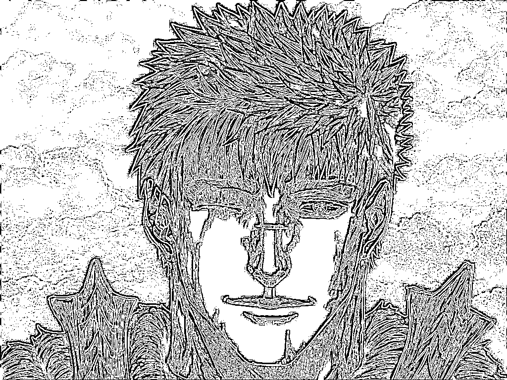

# laba_4
# Лабораторная работа №4. Выделение контуров в изображениях.
## Рисунок ручной отрисовки
Исходное изображение:

Полутоновое изображение:

Градиент по Х:

Градиент по Y:

Градиентная матрица G:

Бинаризованная градиентная матрица G(Бернсен):

Бинаризованная градиентная матрица G(Глобальная бинаризация, порог 25):

## Фото шахматной доски
Исходное изображение:

Полутоновое изображение:

Градиент по Х:

Градиент по Y:

Градиентная матрица G:

Бинаризованная градиентная матрица G(Бернсен):

Бинаризованная градиентная матрица G(Глобальная бинаризация, порог 40):

## Фото человеческого лица
Исходное изображение:

Полутоновое изображение:

Градиент по Х:

Градиент по Y:

Градиентная матрица G:

Бинаризованная градиентная матрица G(Бернсен):

Бинаризованная градиентная матрица G(Глобальная бинаризация, порог 45):

## Кадр из аниме
Исходное изображение:

Полутоновое изображение:

Градиент по Х:

Градиент по Y:

Градиентная матрица G:

Бинаризованная градиентная матрица G(Бернсен):

Бинаризованная градиентная матрица G(Глобальная бинаризация, порог 15):

